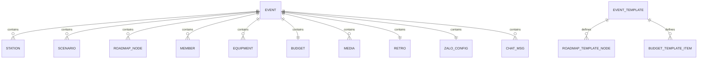

# TÀI LIỆU ĐẶC TẢ TOÀN BỘ REST API & KIẾN TRÚC DỮ LIỆU
## HỆ THỐNG QUẢN LÝ SỰ KIỆN & GIẢI ĐẤU ROBOTICS (AIR EVENTS MODULE)

> **Phiên bản tài liệu:** 2.4.0  
> **Cập nhật lần cuối:** 2026-09-17  
> **Phạm vi áp dụng:** AIR Manager System (Next.js App Router) & AIR Events App (React Vite Client)  

---

## MỤC LỤC

1. [Tổng Quan & Quy Ước Kiến Trúc](#1-tổng-quan--quy-ước-kiến-trúc)
   - [1.1. Base URL & Môi trường](#11-base-url--môi-trường)
   - [1.2. Cơ chế Xác thực & Phân quyền (Auth & RBAC)](#12-cơ-chế-xác-thực--phân-quyền-auth--rbac)
   - [1.3. Định dạng Dữ liệu & Quy ước Thời gian](#13-định-dạng-dữ-liệu--quy-ước-thời-gian)
   - [1.4. Chuẩn Cấu trúc Phản hồi (Standard Response Format)](#14-chuẩn-cấu-trúc-phản-hồi-standard-response-format)
2. [Cấu Trúc Dữ Liệu Chi Tiết (Data Models & Schemas)](#2-cấu-trúc-dữ-liệu-chi-tiết-data-models--schemas)
3. [Danh Mục REST API Chi Tiết](#3-danh-mục-rest-api-chi-tiết)
   - [3.1. Quản lý Sự kiện Cốt lõi (Core Events CRUD)](#31-quản-lý-sự-kiện-cốt-lõi-core-events-crud)
   - [3.2. Tab 1: Kịch bản Trạm & Ma trận Thời gian (Stations & Scenarios)](#32-tab-1-kịch-bản-trạm--ma-trận-thời-gian-stations--scenarios)
   - [3.3. Tab 2: Lộ trình & Phân rã Công việc (Roadmap Work Breakdown)](#33-tab-2-lộ-trình--phân-rã-công-việc-roadmap-work-breakdown)
   - [3.4. Tab 3: Nhân sự Ban Tổ Chức & Điểm Danh (Staff & Check-in)](#34-tab-3-nhân-sự-ban-tổ-chức--điểm-danh-staff--check-in)
   - [3.5. Tab 4: Danh mục Thiết bị & Vật tư (Equipment Checklist)](#35-tab-4-danh-mục-thiết-bị--vật-tư-equipment-checklist)
   - [3.6. Tab 5: Dự toán & Quyết toán Ngân sách (Budget & Expenses)](#36-tab-5-dự-toán--quyết-toán-ngân-sách-budget--expenses)
   - [3.7. Tab 6: Album Media & Drive Sync (Media Gallery)](#37-tab-6-album-media--drive-sync-media-gallery)
   - [3.8. Tab 7: Cấu hình Gửi Tin Zalo ZNS (Zalo Dispatch & Broadcast)](#38-tab-7-cấu-hình-gửi-tin-zalo-zns-zalo-dispatch--broadcast)
   - [3.9. Tab 8: Cẩm nang Hướng dẫn & Checklist (Event Guide)](#39-tab-8-cẩm-nang-hướng-dẫn--checklist-event-guide)
   - [3.10. Tab 9: Tổng kết, Đánh giá & Rút kinh nghiệm (Retrospective)](#310-tab-9-tổng-kết-đánh-giá--rút-kinh-nghiệm-retrospective)
   - [3.11. Quản lý Mẫu Sự kiện (Event Templates Engine)](#311-quản-lý-mẫu-sự-kiện-event-templates-engine)
   - [3.12. Quản lý Nhãn phân loại (Event Tags)](#312-quản-lý-nhãn-phân-loại-event-tags)
   - [3.13. Danh sách Nhân sự Hệ thống (System Users)](#313-danh-sách-nhân-sự-hệ-thống-system-users)
   - [3.14. Kênh Thảo luận Trực tuyến (Realtime Event Chat)](#314-kênh-thảo-luận-trực-tuyến-realtime-event-chat)
   - [3.15. Chia sẻ Công khai & Bảo mật (Public Sharing Token)](#315-chia-sẻ-công-khai--bảo-mật-public-sharing-token)
4. [Quy Chuẩn Nhập / Xuất File Excel & CSV (Excel Specifications)](#4-quy-chuẩn-nhập--xuất-file-excel--csv-excel-specifications)
5. [Bảng Mã Lỗi HTTP & Xử Lý Sự Cố (Error Catalog)](#5-bảng-mã-lỗi-http--xử-lý-sự-cố-error-catalog)

---

## 1. TỔNG QUAN & QUY ƯỚC KIẾN TRÚC

### 1.1. Base URL & Môi trường
- **Môi trường cục bộ (Local Development Backend)**: `http://localhost:3000/api/events`
- **Môi trường cục bộ (Vite React Client)**: `http://localhost:5173`
- **Môi trường Máy chủ Production**: `https://manager.airobot.edu.vn/api/events`

### 1.2. Cơ chế Xác thực & Phân quyền (Auth & RBAC)
1. **Cookie Session**: Cookie httpOnly mang tên `sys1` chứa mã JWT Token đã ký bằng `JWT_SECRET`.
2. **Bearer Header**: Hỗ trợ header `Authorization: Bearer <JWT_TOKEN>`.
3. **Phân quyền người dùng**:
   - `Admin` / `Academic`: Có toàn quyền xem, sửa, xóa, duyệt ngân sách (`canViewBudget = true`), lưu mẫu, gửi tin Zalo broadcast.
   - `Teacher` / `Staff`: Xem các tab được phân quyền, điểm danh nhân sự, đánh dấu checklist thiết bị.
   - `Guest / Viewer (Public Share)`: Chỉ xem được các thông tin công khai (Lộ trình, Kịch bản, Media, Hướng dẫn) qua mã token chia sẻ, **không được xem** Tab Ngân sách hoặc Thảo luận nội bộ.

### 1.3. Định dạng Dữ liệu & Quy ước Thời gian
- Định dạng dữ liệu mặc định: `application/json; charset=utf-8`.
- Định dạng ngày tháng: ISO 8601 UTC (`YYYY-MM-DDTHH:mm:ss.sssZ`) cho timestamp; hoặc `YYYY-MM-DD` cho ngày hẹn lộ trình.
- Mã tiền tệ: Việt Nam Đồng (`VND` - số nguyên nguyên bản, ví dụ `25000000` = 25.000.000 ₫).

### 1.4. Chuẩn Cấu trúc Phản hồi (Standard Response Format)
**Thành công (200 OK / 201 Created):**
```json
{
  "success": true,
  "message": "Thực hiện thao tác thành công",
  "data": { ... }
}
```

**Thất bại (4xx / 5xx Error):**
```json
{
  "success": false,
  "error": "Mô tả chi tiết lỗi phát sinh",
  "code": "ERROR_CODE_IDENTIFIER"
}
```

---

## 2. CẤU TRÚC DỮ LIỆU CHI TIẾT (DATA MODELS & SCHEMAS)



### 2.1. Cấu trúc Tài liệu Sự kiện (`Event`)
| Trường | Kiểu dữ liệu | Bắt buộc | Mô tả |
| :--- | :--- | :---: | :--- |
| `_id` / `id` | `String` / `ObjectId` | Có | Định danh duy nhất sự kiện. |
| `code` | `String` | Không | Mã sự kiện (Ví dụ: `EVT-2026-001`). |
| `title` | `String` | Có | Tên tiêu đề sự kiện (Tối đa 200 ký tự). |
| `type` | `String` | Có | `competition` (Giải đấu), `workshop` (Hội thảo), `exhibition` (Triển lãm), `internal` (Nội bộ), `other` (Khác). |
| `status` | `String` | Có | `planning` (Lập kế hoạch), `upcoming` (Sắp diễn ra), `happening` (Đang diễn ra), `completed` (Hoàn thành), `cancelled` (Đã hủy). |
| `startDate` | `Date` / `String` | Có | Thời gian bắt đầu sự kiện (ISO 8601). |
| `endDate` | `Date` / `String` | Không | Thời gian kết thúc sự kiện. |
| `location` | `String` | Không | Địa điểm tổ chức sự kiện. |
| `description` | `String` | Không | Mô tả chi tiết nội dung sự kiện. |
| `link` | `String` | Không | Link tài liệu liên kết nhanh (Drive, Canva, Docs, Zoom). |
| `banner` | `String` | Không | URL hình ảnh banner sự kiện. |
| `tags` | `Array<String>` | Không | Danh sách các nhãn phân loại. |
| `lead` | `ObjectId` / `Object` | Không | Người phụ trách chính (Trưởng ban tổ chức). |
| `stations` | `Array<Station>` | Không | Danh sách các trạm hoạt động. |
| `scenarios` | `Array<Scenario>` | Không | Ma trận kịch bản các giai đoạn. |
| `roadmap` | `Array<RoadmapNode>`| Không | Cây phân rã công việc & tiến độ. |
| `members` | `Array<Member>` | Không | Danh sách nhân sự & trạng thái điểm danh. |
| `equipmentChecklist` | `Array<Equipment>` | Không | Danh sách trang thiết bị & kiểm tra đóng gói. |
| `budget` | `BudgetObject` | Không | Dự toán, thực chi & link chứng từ. |
| `media` | `Array<MediaItem>` | Không | Thư viện ảnh / album Google Drive. |
| `retro` | `RetroObject` | Không | Đánh giá, rút kinh nghiệm & biểu dương. |
| `zaloConfig` | `ZaloConfigObject` | Không | Cấu hình gửi thông báo Zalo ZNS. |
| `guide` | `GuideObject` | Không | Cẩm nang hướng dẫn & checklist. |
| `shareConfig` | `ShareConfigObject`| Không | Cấu hình chia sẻ công khai qua Token. |

---

## 3. DANH MỤC REST API CHI TIẾT

### 3.1. Quản lý Sự kiện Cốt lõi (Core Events CRUD)

#### `GET /api/events`
Lấy danh sách sự kiện có hỗ trợ phân trang, tìm kiếm và lọc đa điều kiện.

- **Query Parameters:**
  - `status` *(string)*: Lọc theo trạng thái chính xác (`planning`, `upcoming`, `happening`, `completed`, `cancelled`).
  - `scope` *(string)*: Bộ lọc phạm vi (`all`, `planning`, `upcoming`, `happening`, `past`, `archive`).
  - `type` *(string)*: Lọc theo phân loại (`all`, `competition`, `workshop`, `exhibition`, `internal`, `other`).
  - `tag` *(string)*: Lọc theo nhãn/tag.
  - `search` *(string)*: Tìm kiếm theo tiêu đề, mã sự kiện, địa điểm hoặc nhãn.
  - `limit` *(number)*: Số lượng bản ghi mỗi trang (Mặc định: `50`).
  - `page` *(number)*: Số thứ tự trang (Mặc định: `1`).

- **Response `200 OK`:**
```json
{
  "success": true,
  "events": [
    {
      "_id": "684d1e031730348327887b2c",
      "code": "EVT-2026-001",
      "title": "Cuộc Thi AI Robotics Championship 2026",
      "type": "competition",
      "status": "happening",
      "startDate": "2026-10-15T08:00:00.000Z",
      "endDate": "2026-10-15T17:30:00.000Z",
      "location": "Nhà Thi Đấu Thể Thao Đa Năng",
      "tags": ["Robotics", "Giải Đấu Quốc Gia"],
      "lead": {
        "_id": "684d1e031730348327887b2c",
        "name": "Huỳnh Trần Hữu Nhật",
        "email": "nhat.huynh@airobot.edu.vn",
        "phone": "0901234567"
      },
      "progressPercent": 65,
      "totalTasks": 24,
      "completedTasks": 16,
      "overdueTasks": 2,
      "budget": {
        "totalEstimated": 45000000,
        "totalActual": 42150000
      },
      "lastChatMessage": {
        "text": "Đã sạc đầy 100% pin sân Sumo!",
        "senderName": "Phạm Đức Anh",
        "createdAt": "2026-10-15T07:45:00.000Z"
      }
    }
  ],
  "canViewBudget": true
}
```

---

#### `POST /api/events`
Tạo mới sự kiện. Có thể khởi tạo từ một mẫu sự kiện có sẵn (`templateId`).

- **Request Body:**
```json
{
  "title": "Ngày Hội STEM & Trải Nghiệm AI Robotic 2026",
  "type": "workshop",
  "status": "planning",
  "startDate": "2026-11-20T08:00:00.000Z",
  "endDate": "2026-11-20T12:00:00.000Z",
  "location": "Sảnh A, Trung tâm Hội nghị",
  "description": "Ngày hội trải nghiệm công nghệ dành cho học sinh từ 6 - 15 tuổi.",
  "tags": ["STEM", "Trải Nghiệm"],
  "lead": "684d1e031730348327887b2c",
  "templateId": "tpl-stem-workshop-2026"
}
```

- **Response `201 Created`:**
```json
{
  "success": true,
  "message": "Đã tạo sự kiện mới thành công",
  "event": {
    "_id": "684d1e031730348327887b2e",
    "title": "Ngày Hội STEM & Trải Nghiệm AI Robotic 2026",
    "status": "planning",
    "roadmap": [ ... ],
    "budget": { "items": [ ... ] },
    "createdAt": "2026-09-17T10:30:00.000Z"
  }
}
```

---

#### `GET /api/events/[id]`
Lấy toàn bộ thông tin chi tiết của sự kiện bao gồm toàn bộ 9 tabs.

- **Response `200 OK`:**
```json
{
  "success": true,
  "event": {
    "_id": "684d1e031730348327887b2c",
    "title": "Cuộc Thi AI Robotics Championship 2026",
    "type": "competition",
    "status": "happening",
    "startDate": "2026-10-15T08:00:00.000Z",
    "endDate": "2026-10-15T17:30:00.000Z",
    "location": "Nhà Thi Đấu Đa Năng",
    "stations": [ ... ],
    "scenarios": [ ... ],
    "roadmap": [ ... ],
    "members": [ ... ],
    "equipmentChecklist": [ ... ],
    "budget": { ... },
    "media": [ ... ],
    "retro": { ... },
    "zaloConfig": { ... },
    "guide": { ... }
  },
  "canViewBudget": true
}
```

---

#### `PUT /api/events/[id]`
Cập nhật dữ liệu sự kiện (Hỗ trợ cập nhật từng phần - Partial / Merge Update).

- **Request Body:**
```json
{
  "status": "completed",
  "location": "Hội trường 1, Tầng 2",
  "roadmap": [ ... ],
  "equipmentChecklist": [ ... ]
}
```

- **Response `200 OK`:**
```json
{
  "success": true,
  "message": "Cập nhật sự kiện thành công",
  "event": { ... }
}
```

---

#### `DELETE /api/events/[id]`
Xóa vĩnh viễn sự kiện và các dữ liệu liên quan.

- **Response `200 OK`:**
```json
{
  "success": true,
  "message": "Đã xóa sự kiện thành công"
}
```

---

### 3.2. Tab 1: Kịch bản Trạm & Ma trận Thời gian (Stations & Scenarios)

#### Cấu trúc Station (Trạm hoạt động):
```json
{
  "id": "st-sumo",
  "name": "Sa Bàn Thi Đấu Robot Sumo",
  "area": "Khu Vực Sân Thi Đấu Trung Tâm",
  "description": "Nơi diễn ra các trận đấu đối kháng giữa các robot",
  "lead": "684d1e031730348327887b2c",
  "assistingUnits": [
    {
      "id": "unit-1",
      "unitName": "Tổ Trọng Tài & Bấm Giờ",
      "leadPerson": "u-minh",
      "notes": "Kiểm tra pin và cân nặng robot trước trận"
    }
  ]
}
```

#### Cấu trúc Scenario (Giai đoạn ma trận kịch bản):
```json
{
  "id": "sc-phase-1",
  "timeSlot": "08:00 - 09:30",
  "name": "Vòng Bảng: Thi đấu vòng tròn tính điểm",
  "order": 1,
  "details": {
    "st-sumo": {
      "content": "Trọng tài điều hành 12 trận đấu vòng loại bảng A & B",
      "status": "completed"
    },
    "st-checkin": {
      "content": "Hỗ trợ học sinh kiểm tra sa bàn thử nghiệm",
      "status": "in_progress"
    }
  }
}
```

---

### 3.3. Tab 2: Lộ trình & Phân rã Công việc (Roadmap Work Breakdown)

#### Cấu trúc Roadmap Node (Công việc / Cột mốc):
```json
{
  "id": "task-01",
  "parentId": "phase-01", // null nếu là Giai đoạn (Phase Node) gốc
  "name": "Hoàn thiện thể lệ thi đấu & Thiết kế Sa bàn",
  "description": "Thống nhất kích thước sân 1.2m x 1.2m và luật đấu",
  "priority": "high", // 'low' | 'medium' | 'high' | 'urgent'
  "status": "completed", // 'todo' | 'in_progress' | 'completed' | 'blocked'
  "startDate": "2026-09-01",
  "dueDate": "2026-09-10",
  "completed": true,
  "assignees": ["684d1e031730348327887b2c", "u-2"],
  "order": 1
}
```

---

### 3.4. Tab 3: Nhân sự Ban Tổ Chức & Điểm Danh (Staff & Check-in)

#### `GET /api/events/members/template`
Tải file mẫu Excel (.xlsx) chuẩn danh sách nhân sự để điền thông tin.

#### `POST /api/events/[id]/members/import`
Import danh sách nhân sự từ file Excel.
- **Form Data:**
  - `file`: File Excel (.xlsx / .xls)
  - `importMode`: `replace` (thay thế toàn bộ) hoặc `append` (thêm nối tiếp)

#### `GET /api/events/[id]/members/export`
Xuất toàn bộ danh sách nhân sự và trạng thái điểm danh ra file Excel.

#### Cấu trúc Member (Nhân sự sự kiện):
```json
{
  "id": "m-01",
  "userId": "684d1e031730348327887b2c",
  "name": "Huỳnh Trần Hữu Nhật",
  "role": "Trưởng Ban Tổ Chức",
  "phone": "0901234567",
  "email": "nhat.huynh@airobot.edu.vn",
  "organization": "AI Robotic",
  "isExternal": false,
  "station": "Khu Vực Chung",
  "checkInStatus": true,
  "checkInTime": "2026-10-15T07:15:00.000Z",
  "notes": "Có mặt sớm 45 phút để họp bàn phân công"
}
```

---

### 3.5. Tab 4: Danh mục Thiết bị & Vật tư (Equipment Checklist)

#### `GET /api/events/equipment/template`
Tải file mẫu Excel (.xlsx) chuẩn danh sách thiết bị cần mang theo.

#### `POST /api/events/[id]/equipment/import`
Import danh mục thiết bị từ file Excel (.xlsx / .csv).

#### Cấu trúc Equipment Item (Thiết bị / Vật tư):
```json
{
  "id": "eq-01",
  "name": "Mô hình Sa bàn Sumo Gỗ chuẩn 1.2m x 1.2m",
  "category": "Robot Sumo & Phụ kiện",
  "quantity": 4,
  "unit": "Cái",
  "assignedStation": "Sa Bàn Thi Đấu Robot Sumo",
  "assigneeName": "Nguyễn Văn Minh",
  "isPacked": true,
  "isReturned": false,
  "condition": "Tốt",
  "notes": "Kèm theo viền gỗ bảo vệ chống rơi"
}
```

---

### 3.6. Tab 5: Dự toán & Quyết toán Ngân sách (Budget & Expenses)

#### Cấu trúc Budget:
```json
{
  "currency": "VND",
  "totalEstimated": 45000000,
  "totalActual": 42150000,
  "items": [
    {
      "id": "bg-01",
      "name": "Thuê Địa điểm & Sân bãi Thi đấu",
      "category": "venue", // 'venue' | 'equipment' | 'prizes' | 'marketing' | 'catering' | 'logistics' | 'other'
      "type": "expense", // 'expense' | 'income'
      "estimatedCost": 15000000,
      "actualCost": 15000000,
      "isPaid": true,
      "status": "paid",
      "paidBy": "684d1e031730348327887b2c",
      "payerName": "Huỳnh Trần Hữu Nhật",
      "proofLink": "https://drive.google.com/file/d/1abc.../view",
      "note": "Hợp đồng thuê 1 ngày kèm âm thanh ánh sáng"
    }
  ]
}
```

---

### 3.7. Tab 6: Album Media & Drive Sync (Media Gallery)

#### Cấu trúc Media Item:
```json
{
  "id": "med-01",
  "fileId": "1syIZ0XYkmnYCYnQ6TRw1eCTgvKTuBZtR",
  "title": "Toàn cảnh lễ khai mạc giải đấu",
  "type": "image", // 'image' | 'video' | 'document'
  "url": "https://lh3.googleusercontent.com/d/1syIZ0XYkmnYCYnQ6TRw1eCTgvKTuBZtR=w800",
  "driveUrl": "https://drive.google.com/file/d/1syIZ0XYkmnYCYnQ6TRw1eCTgvKTuBZtR/view",
  "uploader": "Lê Hoàng Long",
  "uploadedAt": "2026-10-15T09:00:00.000Z"
}
```

---

### 3.8. Tab 7: Cấu hình Gửi Tin Zalo ZNS (Zalo Dispatch & Broadcast)

#### `POST /api/events/[id]/zalo`
Gửi tin nhắn Zalo điều phối hàng loạt đến nhân sự hoặc phụ huynh.

- **Request Body:**
```json
{
  "recipientType": "members", // 'members' | 'custom'
  "templateId": "zns_tpl_staff_dispatch_01",
  "message": "Xin chào {name}, bạn được phân công phụ trách {station} tại sự kiện {event_title}. Vui lòng có mặt lúc 07:00 ngày {event_date}.",
  "memberIds": ["m-01", "m-02", "m-03"]
}
```

- **Các biến hỗ trợ tự động thay thế (Placeholders):**
  - `{name}` hoặc `{member_name}`: Họ và tên nhân sự.
  - `{event_title}`: Tên sự kiện.
  - `{station}`: Tên trạm được phân công.
  - `{role}`: Vai trò trong sự kiện.
  - `{event_date}`: Ngày diễn ra sự kiện.
  - `{location}`: Địa điểm tổ chức.

---

### 3.9. Tab 8: Cẩm nang Hướng dẫn & Checklist (Event Guide)

#### Cấu trúc Guide:
```json
{
  "sections": [
    {
      "id": "sec-01",
      "title": "Quy trình xử lý sự cố kỹ thuật sa bàn",
      "content": "1. Ngắt nguồn pin ngay lập tức khi phát hiện chập cháy\n2. Thay thế xe dự phòng trong vòng 3 phút",
      "checklist": [
        { "id": "chk-01", "text": "Mang theo đồng hồ đo vạn năng VOM", "isDone": true },
        { "id": "chk-02", "text": "Chuẩn bị 5 mỏ hàn thiếc di động", "isDone": false }
      ]
    }
  ]
}
```

---

### 3.10. Tab 9: Tổng kết, Đánh giá & Rút kinh nghiệm (Retrospective)

#### Cấu trúc Retrospective:
```json
{
  "whatWentWell": [
    { "id": "w-01", "text": "Học sinh tham gia đúng giờ, sa bàn hoạt động trơn tru", "author": "Nguyễn Văn Minh" }
  ],
  "whatCouldBeImproved": [
    { "id": "i-01", "text": "Cần thêm 2 micro không dây cho khu vực trọng tài", "author": "Lê Hoàng Long" }
  ],
  "actionItems": [
    { "id": "a-01", "task": "Mua bổ sung 10 cục pin dự phòng cho giải tiếp theo", "assignee": "Phạm Đức Anh", "status": "todo" }
  ],
  "kudos": [
    { "id": "k-01", "to": "Đội Kỹ Thuật", "message": "Xử lý sự cố robot thần tốc trong 2 phút", "from": "Huỳnh Trần Hữu Nhật" }
  ]
}
```

---

### 3.11. Quản lý Mẫu Sự kiện (Event Templates Engine)

#### `GET /api/events/templates`
Lấy danh sách các mẫu quy trình sự kiện dựng sẵn.

#### `POST /api/events/templates`
Lưu sự kiện hiện tại thành một mẫu sự kiện mới (Tính năng **Lưu làm mẫu**).

- **Request Body:**
```json
{
  "name": "Mẫu Ngày Hội STEM Trường Học Chuẩn",
  "type": "workshop",
  "description": "Mẫu chuẩn gồm 4 trạm trải nghiệm, 22 công việc lộ trình và bảng dự toán 12 mục",
  "roadmapNodes": [
    {
      "id": "node-01",
      "parentId": null,
      "name": "Giai đoạn 1: Chuẩn bị tiền sự kiện (D-30 đến D-10)",
      "relativeDaysStart": -30,
      "relativeDaysDue": -10,
      "priority": "high",
      "order": 1
    },
    {
      "id": "node-02",
      "parentId": "node-01",
      "name": "Khảo sát mặt bằng sảnh trường & nguồn điện",
      "relativeDaysStart": -25,
      "relativeDaysDue": -20,
      "priority": "high",
      "order": 1
    }
  ],
  "budgetItems": [
    {
      "id": "bg-tpl-01",
      "name": "In ấn Backdrop & Standee chào mừng",
      "category": "marketing",
      "defaultEstimatedCost": 3500000,
      "note": "Kích thước 4m x 2.5m hiflex cán mờ"
    }
  ]
}
```

- **Quy tắc tính toán ngày tự động khi áp dụng mẫu (D-Day Engine):**
  Khi người dùng tạo sự kiện mới từ Mẫu với ngày bắt đầu là $D_{start}$:
  $$\text{Task Start Date} = D_{start} + \text{relativeDaysStart} \times 86400000\text{ ms}$$
  $$\text{Task Due Date} = D_{start} + \text{relativeDaysDue} \times 86400000\text{ ms}$$

---

### 3.12. Quản lý Nhãn phân loại (Event Tags)

#### `GET /api/events/tags`
Lấy danh sách tất cả các nhãn phân loại sự kiện.

#### `POST /api/events/tags`
Tạo nhãn mới:
```json
{
  "name": "Cuộc Thi Quốc Tế",
  "color": "bg-indigo-100 text-indigo-800"
}
```

#### `DELETE /api/events/tags/[id]`
Xóa nhãn phân loại theo ID.

---

### 3.13. Danh sách Nhân sự Hệ thống (System Users)

#### `GET /api/events/users`
Lấy danh sách tài khoản nhân sự trong hệ thống AIR để phân công vào ban tổ chức sự kiện.

- **Response `200 OK`:**
```json
{
  "success": true,
  "users": [
    {
      "_id": "684d1e031730348327887b2c",
      "name": "Huỳnh Trần Hữu Nhật",
      "email": "nhat.huynh@airobot.edu.vn",
      "phone": "0901234567",
      "role": ["Admin"],
      "avt": "https://lh3.googleusercontent.com/d/..."
    }
  ]
}
```

---

### 3.14. Kênh Thảo luận Trực tuyến (Realtime Event Chat)

#### `GET /api/events/[id]/chat`
Lấy toàn bộ lịch sử tin nhắn trong phòng trao đổi nhanh của sự kiện.

#### `POST /api/events/[id]/chat`
Gửi tin nhắn mới vào phòng thảo luận:
```json
{
  "text": "Đã tập kết đầy đủ 12 robot Sumo tại sảnh chính!"
}
```

---

### 3.15. Chia sẻ Công khai & Bảo mật (Public Sharing Token)

#### `POST /api/events/[id]/share`
Bật/tắt chế độ chia sẻ công khai và tạo token chia sẻ an toàn.
```json
{
  "isPublic": true
}
```

#### `GET /api/events/share/[token]`
Endpoint mở (Không cần đăng nhập) dành cho phụ huynh/thí sinh xem lịch trình và kịch bản.

---

## 4. QUY CHUẨN NHẬP / XUẤT FILE EXCEL & CSV (EXCEL SPECIFICATIONS)

### 4.1. Mẫu Excel Thiết Bị (`Mau_Import_Thiet_Bi.xlsx`)
| STT | Tên thiết bị / linh kiện (*) | Số lượng (*) | Đơn vị | Phân loại | Trạm phụ trách | Người phụ trách | Ghi chú |
| :---: | :--- | :---: | :---: | :--- | :--- | :--- | :--- |
| 1 | Mô hình Sa bàn Sumo Gỗ 1.2m | 4 | Cái | Robot Sumo & Phụ kiện | Sa Bàn Thi Đấu | Nguyễn Văn Minh | Kèm viền gỗ bảo vệ |
| 2 | Robot Sumo Bluetooth AI-Bot | 12 | Con | Robot Sumo & Phụ kiện | Sa Bàn Thi Đấu | Phạm Đức Anh | Đã sạc đầy pin 100% |

### 4.2. Mẫu Excel Nhân Sự (`Mau_Import_Nhan_Su.xlsx`)
| STT | Họ và tên (*) | Vai trò (*) | Số điện thoại | Email | Đơn vị / Trường | Ghi chú |
| :---: | :--- | :--- | :--- | :--- | :--- | :--- |
| 1 | Huỳnh Trần Hữu Nhật | Trưởng ban tổ chức | 0901234567 | nhat.huynh@airobot.edu.vn | AI Robotic | Điều phối toàn diện |
| 2 | Nguyễn Văn Minh | Trưởng Ban Kỹ Thuật | 0912345678 | minh.nguyen@airobot.edu.vn | AI Robotic | Phụ trách sa bàn |

---

## 5. BẢNG MÃ LỖI HTTP & XỬ LÝ SỰ CỐ (ERROR CATALOG)

| HTTP Status | Mã lỗi (Error Code) | Nguyên nhân & Hướng xử lý |
| :---: | :--- | :--- |
| `200 OK` | `SUCCESS` | Thao tác truy vấn hoặc cập nhật dữ liệu thành công. |
| `201 Created` | `CREATED` | Tạo mới sự kiện / bản ghi thành công. |
| `400 Bad Request` | `VALIDATION_ERROR` | Thiếu trường dữ liệu bắt buộc (`title`, `startDate`), sai định dạng ngày hoặc file Excel không đúng cấu trúc. |
| `401 Unauthorized` | `AUTH_REQUIRED` | Chưa đăng nhập hoặc Cookie JWT `sys1` đã hết hạn. |
| `403 Forbidden` | `PERMISSION_DENIED` | Người dùng không có quyền Admin/Academic để xem Tab Ngân sách hoặc xóa sự kiện. |
| `404 Not Found` | `EVENT_NOT_FOUND` | ID sự kiện hoặc Token chia sẻ không tồn tại trong hệ thống. |
| `500 Server Error` | `INTERNAL_SERVER_ERROR` | Lỗi kết nối cơ sở dữ liệu MongoDB hoặc xử lý backend. |
